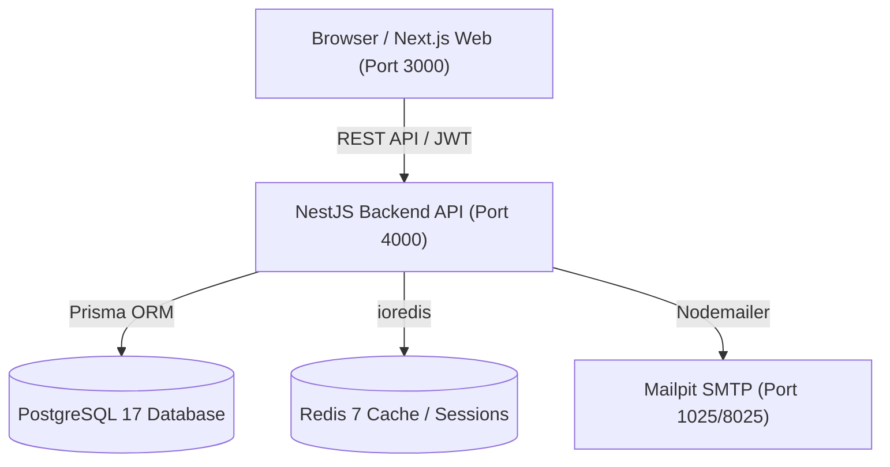

# NovaStore Architecture Overview

## Monorepo Layout

NovaStore is structured as a high-performance modular monorepo managed with **pnpm workspaces** and **Turborepo**.

```
ecommerce-platform-monorepo/
├── apps/
│   ├── api/                 # NestJS Backend API (Modular Architecture)
│   │   ├── src/
│   │   │   ├── common/      # Guards, Interceptors, Filters, DTOs, Decorators
│   │   │   ├── config/      # Environment configuration & validation
│   │   │   ├── modules/     # Feature modules (auth, products, cart, orders, etc.)
│   │   │   └── main.ts      # Bootstrap entry point with Swagger & ValidationPipe
│   └── web/                 # Next.js 15 App Router Frontend
│       ├── src/
│       │   ├── app/         # App router routes ((shop), (auth), (admin))
│       │   ├── components/  # Feature components & shared UI
│       │   ├── lib/         # API clients, auth store, utilities
│       │   └── hooks/       # Custom React query hooks
├── packages/
│   ├── config/              # Shared constants & runtime configurations
│   ├── database/            # Prisma schema, migrations, client & seeders
│   ├── eslint-config/       # Unified ESLint presets (base, next, nest)
│   ├── tsconfig/            # Shared TypeScript configurations (base, nextjs, nest)
│   ├── types/               # Domain models, Enums, DTOs, API envelopes
│   └── ui/                  # Reusable shadcn/ui components & Tailwind styling
├── infra/
│   └── docker/              # Docker Compose (PostgreSQL 17, Redis 7, Mailpit) & Dockerfiles
├── docs/                    # Architectural and setup guides
├── turbo.json               # Turbo pipeline definitions
├── pnpm-workspace.yaml      # Monorepo workspace mapping
└── package.json             # Root task orchestration scripts
```

## System Architecture



## Technology Stack

- **Frontend**: Next.js 15, React 19, TypeScript, Tailwind CSS, shadcn/ui, TanStack Query, Zustand, React Hook Form, Zod, Lucide Icons.
- **Backend**: NestJS 11, Express, TypeScript, Passport JWT, Throttler, Class-Validator, Swagger OpenAPI.
- **Database & ORM**: PostgreSQL 17, Prisma ORM 6.
- **Caching**: Redis 7 (ioredis).
- **Workspace & Tooling**: pnpm 9, Turborepo 2, Prettier 3, ESLint 8/9.
